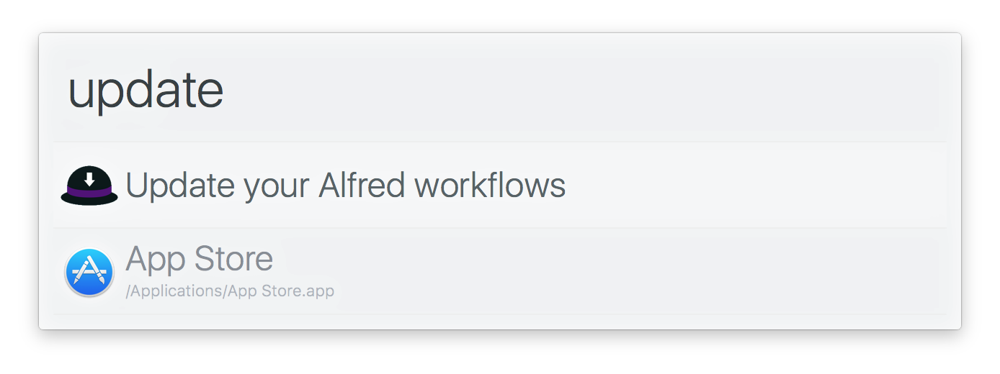

# alfred-updatr [](https://travis-ci.org/SamVerschueren/alfred-updatr)

> [Alfred](https://www.alfredapp.com/) workflow updater

Note that this workflow will only update the workflows managed by npm, including itself.




## Install

```
$ npm install -g alfred-updatr
```

*Requires [Node.js](https://nodejs.org) 4+ and the Alfred [Powerpack](https://www.alfredapp.com/powerpack/).*


## Usage


In Alfred, type `updatr` and <kbd>Enter</kbd>.<br>
The workflow will start updating all the outdated workflows and will notify you when it's done.

> Note: Updating your workflows can take a while. Be patient!


## Related

- [alfy](https://github.com/sindresorhus/alfy) - Create Alfred workflows with ease
- [alfred-notifier](https://github.com/samverschueren/alfred-notifier) - Update notifications for your Alfred workflow


## License

MIT © [Sam Verschueren](https://github.com/SamVerschueren)
